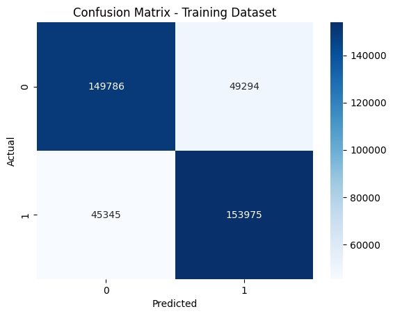
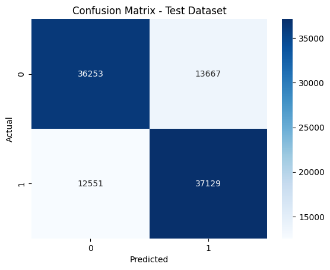

# Photon vs Electron Classification using ResNet-15

This repository contains a deep learning-based classification model to distinguish between photons and electrons using a ResNet-15 architecture. The dataset consists of calorimeter data stored in HDF5 files.

## Table of Contents
- [Project Overview](#project-overview)
- [Dataset](#dataset)
- [Installation](#installation)
- [Usage](#usage)
- [Training](#training)
- [Evaluation](#evaluation)
- [Results](#results)
- [Model Saving](#model-saving)
- [Acknowledgments](#acknowledgments)

## Project Overview
The goal of this project is to classify photons and electrons based on calorimeter data. We use a custom ResNet-15 model trained on two-channel 32x32 matrices representing hit energy and time. Hyperparameter tuning is performed using Optuna to optimize model performance.

## Dataset
The dataset consists of two HDF5 files:
- `SinglePhoton.hdf5`: Contains data and labels for photon events.
- `SingleElectron.hdf5`: Contains data and labels for electron events.

Labels:
- **0**: Photon
- **1**: Electron

## Installation
Ensure you have Python installed and set up a virtual environment. Then, install the required dependencies:

```bash
pip install torch torchvision torchaudio optuna h5py numpy tqdm scikit-learn seaborn matplotlib
```

## Usage
1. Clone this repository:
   ```bash
   git clone https://github.com/yourusername/photon-electron-classification.git
   cd photon-electron-classification
   ```
2. Place the dataset files (`SinglePhoton.hdf5` and `SingleElectron.hdf5`) in the project directory.
3. Run the training script:

## Training
The model is trained using ResNet-15, with the following steps:
- Load and preprocess the dataset.
- Split into training (80%) and test (20%) datasets.
- Use 50% of the training set for hyperparameter tuning (50% training, 50% validation).
- Perform Optuna-based hyperparameter optimization.
- Train the best model on the full dataset for 20 epochs.

## Evaluation
After training, the model is evaluated on both the training and test datasets. The script outputs:
- **Precision, Recall, F1-score, and Accuracy**
- **Confusion Matrix** for visualization

## Results
Final model performance:
| Dataset  | Precision | Recall | F1-score | Accuracy |
|----------|-----------|--------|----------|----------|
| Training | 76.26%    | 76.24% | 76.24%   | 76.25%   |
| Test     | 73.69%    | 73.68% | 73.67%   | 73.68%   |
### Confusion Matrix
Training Set:


Test Set:


## Model Saving
The trained model is saved as:
```bash
Electron_photon_Resnet_classifier.pth
```
To load the model for inference:
```python
import torch
from model import ResNet15

model = ResNet15()
model.load_state_dict(torch.load("Electron_photon_Resnet_classifier.pth"))
model.eval()
```

## Acknowledgments
- This project is inspired by calorimeter-based event classification in high-energy physics.
- Special thanks to ML4Sci for providing the dataset.
- Special thanks to open-source deep learning communities.

---
**Author:** Tejas Patange   
**Contact:** tejpatange@gmail.com

